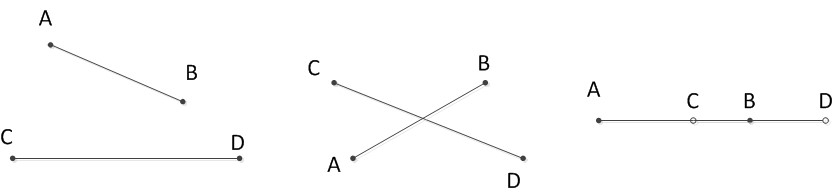

# 计算几何

## 线段相交

### 基础知识：

- 矢量叉乘

设矢量$$P=(x_{1},y_{1}), Q=(x_{2},y_{2})$$
则矢量叉积定义为：$$P \times Q = x_{1} \cdot y_{2} - x_{2} \cdot y_{1}$$得到的是一个标量
且有性质：$$P \times Q = - (Q \times P), P \times (-Q) = - (P \times Q)$$

### 判断线段相交，主要有以下两个步骤：
#### 1.快速排斥试验
设以线段AB为对角线的矩形为R， 设以线段CD为对角线的矩形为T，如果R和T不相交，显然两线段不会相交
#### 2.跨立试验
①判断A点B点是否在线段CD的两侧，即计算叉积时异号
②判断C点D点是否在线段AB的两侧，即计算叉积时异号
③处理特殊情况，即ABCD四个点有至少三个点共线的情况，即出现叉积为零的情况，如果A点与线段CD共线，则要查看A点是否在线段CD上，其它情况依次类推。

## 凸包

### 基础知识：

- 凸包：用最小的凸多边形将n个点围在里面的图形为凸包

- 向量：

-- 点积：
$$(a,b) \cdot (c,d) = (a \cdot b , c \codt d) = |(a,b)| \cdot |(c,d)| \cdot \cos((a,b),(c,d))$$

-- 叉积：
$$(a,b) \times (c,d) = a \cdot d - b \codt c = |(a,b)| \cdot |(c,d)| \cdot \sin((a,b),(c,d))$$

- 几何意义：以$$(a,b) , (c,d)$$两向量作平行四边形，它俩的叉积为其面积

- 极角：与x轴的夹角，STL库有atan2函数，atan2(y,x)求出向量(x,y)的极角

### 使用Graham扫描法解决凸包问题